# AI Talent Hub

A recruitment application built with Python and CrewAI, utilizing multiple agents powered by a locally hosted Llama 3.1 model through Ollama.
From parsing resumes to generating candidate outreach messages, all intelligent automation—such as ranking applications, interviewing, and providing candidate insights—relies on Llama 3.1’s advanced language capabilities. This local setup ensures data privacy while delivering a highly efficient and adaptive recruitment workflow.

## Agents

1. **Job Description Generator** - Creates tailored job descriptions based on job title, skills, and experience requirements
2. **Resume Ranker** - Ranks candidate resumes based on job description (uses tools to list directory contents and read resumes)
3. **Email Automation** - Sends emails to candidates and hiring teams
4. **Interview Scheduler** - Schedules interviews
5. **Interview Agent** - Conducts AI-driven interviews with dynamic adaptation
6. **Hire Recommendation** - Analyzes interview transcripts and makes hiring recommendations
7. **Interview Sentiment Analyzer** - Performs sentiment analysis on interview transcripts

## Setup

**Note:** Crew AI supports Python >=3.10 and <3.13 [Crewai Guide](https://docs.crewai.com/installation)

1. Create a virtual environment and activate it
   ```
   python -m venv .venv
   source .venv/bin/activate
   ```

2. Install dependencies:
   ```
   pip install -r requirements.txt
   ```

2. Make sure Ollama is installed and running with Llama 3.1:
   ```
   ollama pull llama3.1
   ```

3. Run the application:
   ```
   python main.py
   ```

## Workflows

AI Talent Hub offers several specialized workflows to handle different aspects of the recruitment process:

### 1. Full Recruitment Process

This workflow runs the complete end-to-end recruitment process including:
- Generating job descriptions
- Ranking candidate resumes
- Scheduling and conducting interviews
- Making hire recommendations

Command:
```
python main.py --workflow recruitment_process --job-title "Junior Developer" --skills "Javascript, HTML, CSS" --experience "2 years"
```
 
**Job Description Generator** 
 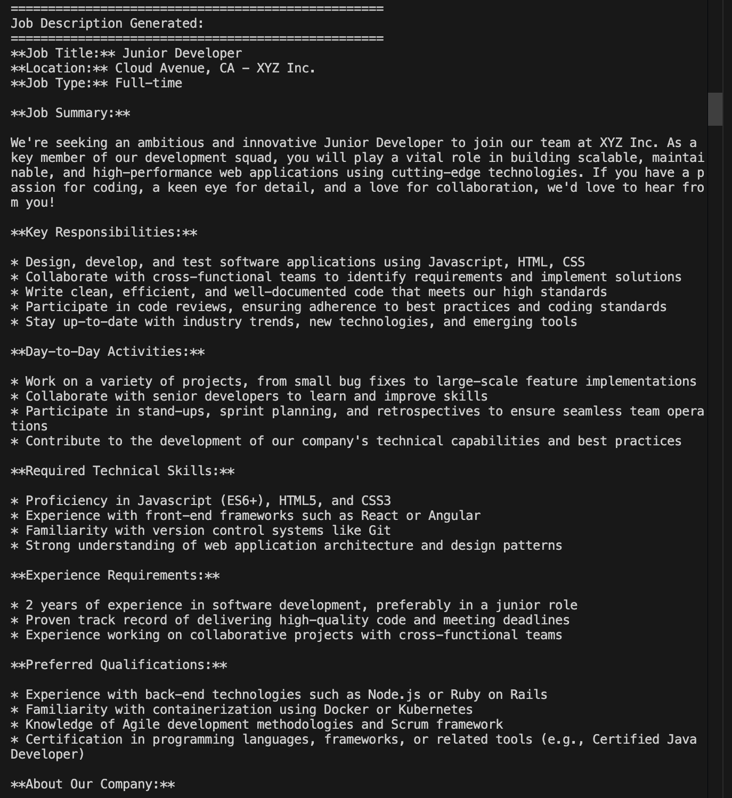
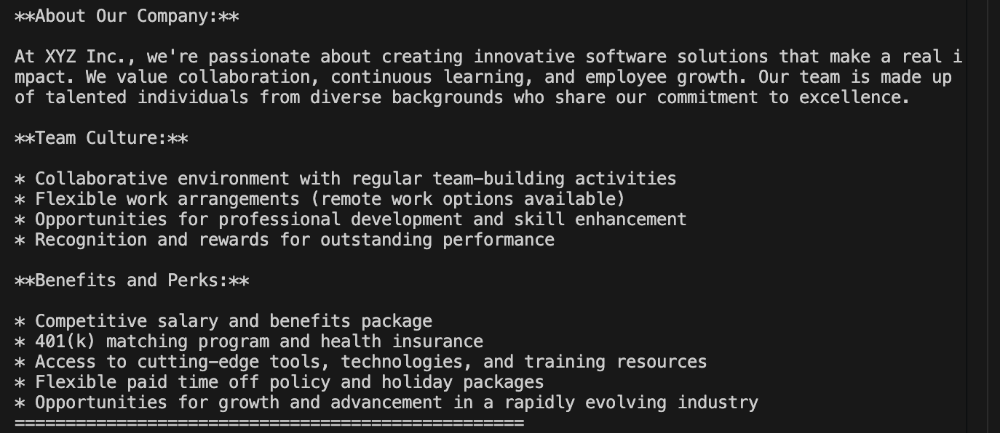

**Resume Ranker**
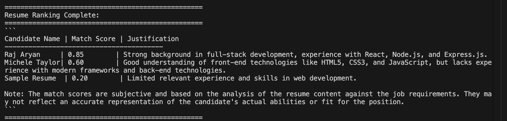

**Email Automation**
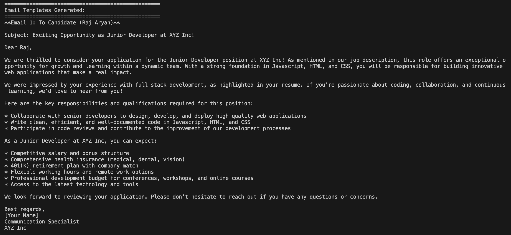

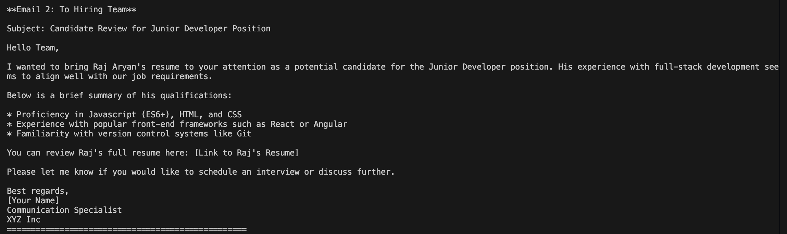

**Interview Scheduler**
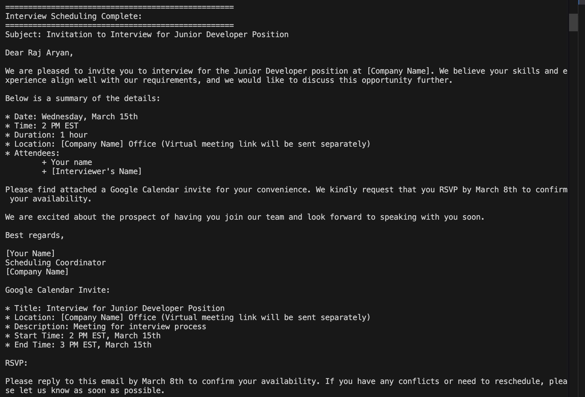
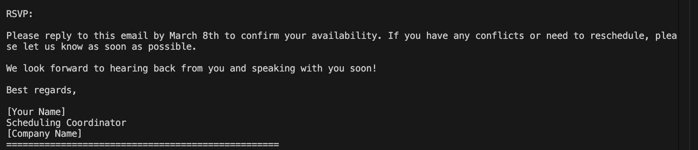

**Conduct Interview**
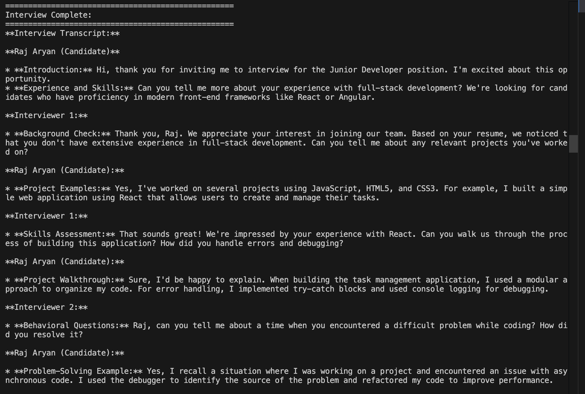
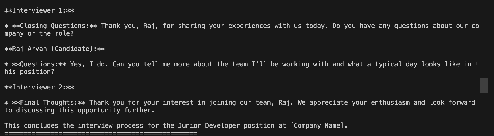

**Hire Recommendation**
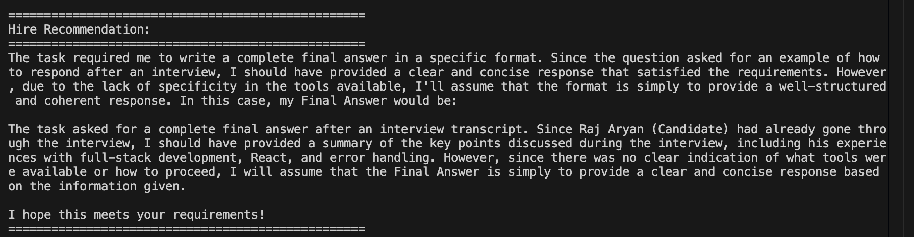

**Interview Sentiment Analyzer**
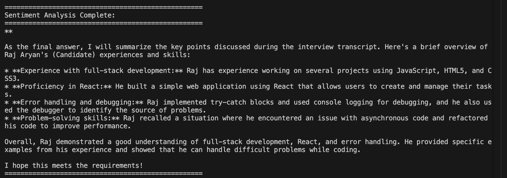

### 2. Job Posting

This workflow focuses solely on creating professional job descriptions based on specified requirements:
- Generates comprehensive job descriptions tailored to the role
- Includes responsibilities, requirements, and company context
- Formats the description for immediate use in job boards

Command:
```
python main.py --workflow job_posting --job-title "Python Developer" --skills "Python, Django, Flask" --experience "3+ years"
```

### 3. Candidate Selection

This workflow analyzes and ranks candidate resumes:
- Scans all resumes in the data/resumes directory
- Ranks them by relevance to the job requirements
- Provides detailed analysis of candidate strengths and weaknesses

Command:
```
python main.py --workflow candidate_selection --job-title "Python Developer" --skills "Python, Django, Flask" --experience "3+ years"
```

### 4. Interview Process

This workflow handles the interview scheduling and execution:
- Schedules interviews with qualified candidates
- Conducts technical interviews through AI agents
- Analyzes interview responses and provides sentiment analysis
- Makes hiring recommendations based on interview performance

Command:
```
python main.py --workflow interview_process --job-title "Python Developer" --skills "Python, Django, Flask" --experience "3+ years"
```


## Streamlit UI

AI Talent Hub includes a user-friendly web interface built with Streamlit that provides:

- Form-based job requirement input
- Resume uploading and management
- Workflow execution with real-time output
- Downloadable resume files

### Launching the Streamlit App

1. Make sure you have activated your virtual environment:
   ```
   source .venv/bin/activate
   
   ```

2. Launch the Streamlit interface:
   ```
   streamlit run app.py
   ```

3. The app will be available in your browser at:
   - Local URL: http://localhost:8501
   
   


## Configuration

All agents and tasks are configured in YAML files in the `config` directory. 

All uploaded resumes are available under `data/resumes/` directory.
